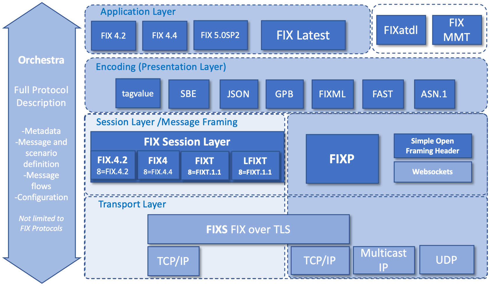
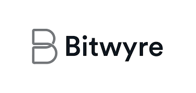

<!-- omit in TOC -->
# Fasters

Fasters is free and open source FIX engine implementation in Rust. Please note that it's currently under heavy development and wildly unstable, so all interested parties should refrain from using it in production prior to `1.0.0` release. Performance and full adherence to the FIX protocol are core goals of the project which, if anything, might serve as a useful foundation for others' work.

- [About](#about)
- [Sponsors](#sponsors)
- [Contributing](#contributing)
- [Legal](#legal)

## About

Fasters provides parsing, validation, error recovery, and (de)serialization for the FIX Protocol.

The above illustration succintly describes the full scope of FIX and it serves as a reference point for all modern FIX implementations. Fasters aims with total compliance... *eventually*. Engineering efforts are initially focused on core features e.g. tag-value encoding and FIX 4.4.

Fasters enforces strict separation of concerns according to the OSI model, as reasonably allowed by the FIX specification.

- Layer 4 (Transport Layer): `fasters::transport`.
- Layer 5 (Session Layer): `fasters::session`.
- Layer 6 (Presentation Layer): `fasters::encoders`.
- Layer 7 (Application Layer): `fasters::app`.

You don't have to understand the whole tech stack to use a single layer; in fact, Fasters makes sure that you only ever need to worry about layers above your chosen abstraction level. For most users, that would be Layer 7 (i.e. semantics of FIX messages and business logic). On the other hand, you will need to delve deep into lower layers in case you plan on building a fully-fledged FIX engine.

**Core features:**

- [X] Code generation (Rust, possibly others).
- [X] FIX 4.2.
- [X] FIX 4.4.
- [X] FIX 5.0 Service Pack 2.

**Encodings:**

- [ ] Tagvalue (classic FIX).
- [ ] FIXML.
- [ ] Simple Binary Encoding (SBE).
- [ ] Google Protocol Buffers (GPB).
- [ ] JavaScript Object Notation (JSON).
- [ ] Abstract Syntax Notation (ASN.1).
- [ ] FIX Adapted for STreaming (FAST).

## Sponsors

*Fasters is kindly sponsored by **Bitwyre**. Bitwyre is a next gen, HFT-friendly Cryptocurrency Derivatives Exchange.*

Please reach out to `Filippo Costa <filippo.costa@protonmail.com>` for business inquiries.

## Contributing

All development happens on GitHub at [`neysofu/fasters`](https://github.com/neysofu/fasters). Contributions both from volunteers and companies are welcome. Depending on the size and scope of your intented contributions, it's likely a good idea to open beforehand a pull request to discuss any details. Please note that our branching strategy is inspired by the (in)famous [Git Flow](https://nvie.com/posts/a-successful-git-branching-model/), which is a good fit for software that requires complex versioning such as FIX implementations. Versioning adheres to [SemVer 2.0](https://semver.org/).

Please reach out to Filippo Costa `filippo.costa@protonmail.com` if you want to provide more structured and long-term contribution efforts.

## Legal

Fasters is available under the terms of the MIT license. See the `LICENSE.txt` file in this repository for more information.

All FIX Protocol-related intellectual property, including but not limited to the original documentation that ships with Fasters, is licensed by FIX Protocol Ltd. under *Creative Commons Attribution - No Derivatives 4.0 International* (CC BY-ND 4.0). By contributing to this project you agree to comply with all license requirements.

THE SOFTWARE IS PROVIDED "AS IS", WITHOUT WARRANTY OF ANY KIND, EXPRESS OR
IMPLIED, INCLUDING BUT NOT LIMITED TO THE WARRANTIES OF MERCHANTABILITY,
FITNESS FOR A PARTICULAR PURPOSE AND NONINFRINGEMENT. IN NO EVENT SHALL THE
AUTHORS OR COPYRIGHT HOLDERS BE LIABLE FOR ANY CLAIM, DAMAGES OR OTHER
LIABILITY, WHETHER IN AN ACTION OF CONTRACT, TORT OR OTHERWISE, ARISING FROM,
OUT OF OR IN CONNECTION WITH THE SOFTWARE OR THE USE OR OTHER DEALINGS IN THE
SOFTWARE.

Links to third-party documentation and resources.

- [FIXwiki](http://fixwiki.org/fixwiki/FIXwiki)
- [FIX @ Wikipedia](https://it.wikipedia.org/wiki/Financial_Information_eXchange_Protocol)
- [FAST @ Wikipedia](https://en.wikipedia.org/wiki/FAST_protocol)
- [FIX Protocol, Ltd's official website](https://www.fixtrading.org)
- [ValidFIX: FIX parser online](http://www.validfix.com/fix-analyzer.html)
- [OnixS FIX dictionary browser](https://www.onixs.biz/fix-dictionary.html)
